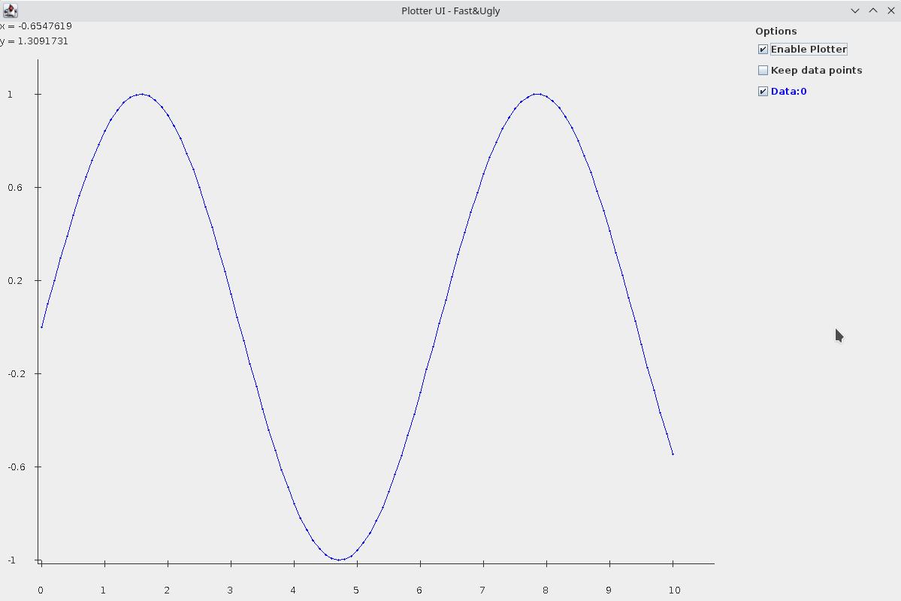

This software does fast live plotting of x-y-data.
You can autoscale, move and zoom while new data is coming

## Some pictures



## License

This software stands under public domain
(To be done: remove old LGPL headers)

## Usage

See Demo.java

```
LivePlotPanel panel = new LivePlotPanel();
SwingUtilities.invokeLater(() -> {
    int frameHeight = 800;
    int frameWidth = 1200;
    JFrame frame = new JFrame("Plotter UI - Fast&Ugly");
    frame.setDefaultCloseOperation(JFrame.EXIT_ON_CLOSE);
    frame.setSize(frameWidth, frameHeight);
    frame.add(panel.getComponent());
    frame.setVisible(true);

    MainPool pool = MainPool.getDefault();
    XYVectorInterface data = pool.createXYVector(VectorInterface.class, VectorInterface.class);
    for (double i = 0; i < 10; i += .1) {
        data.add(i, Math.sin(i));
    }
    panel.getPlotPanel().addData(data);
    panel.setEnabled(true);
    panel.getPlotPanel().automaticScaleAll();
    panel.getPlotPanel().repaint();
});
```